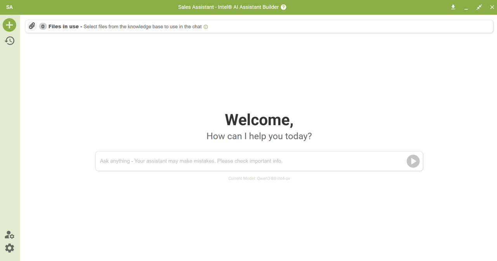
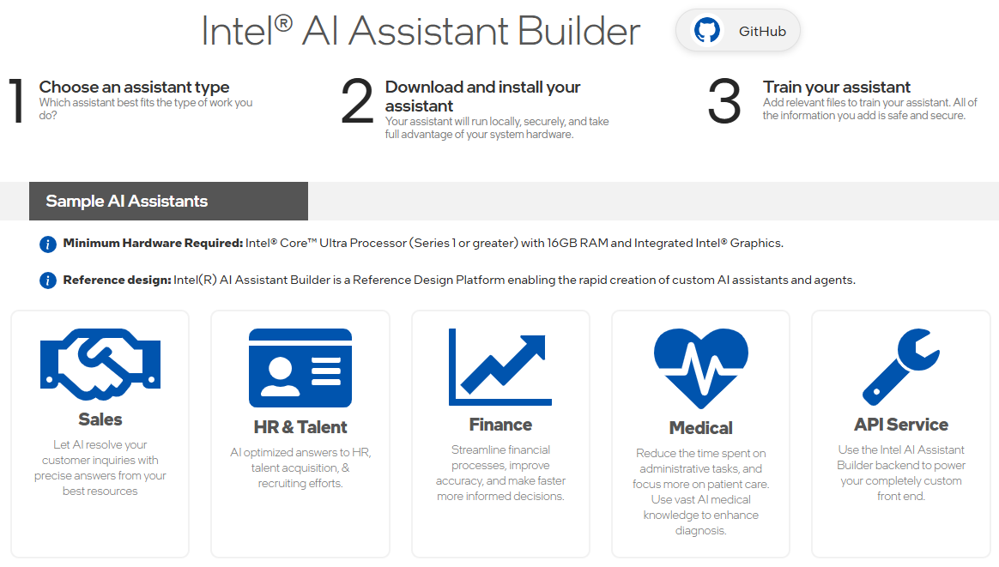
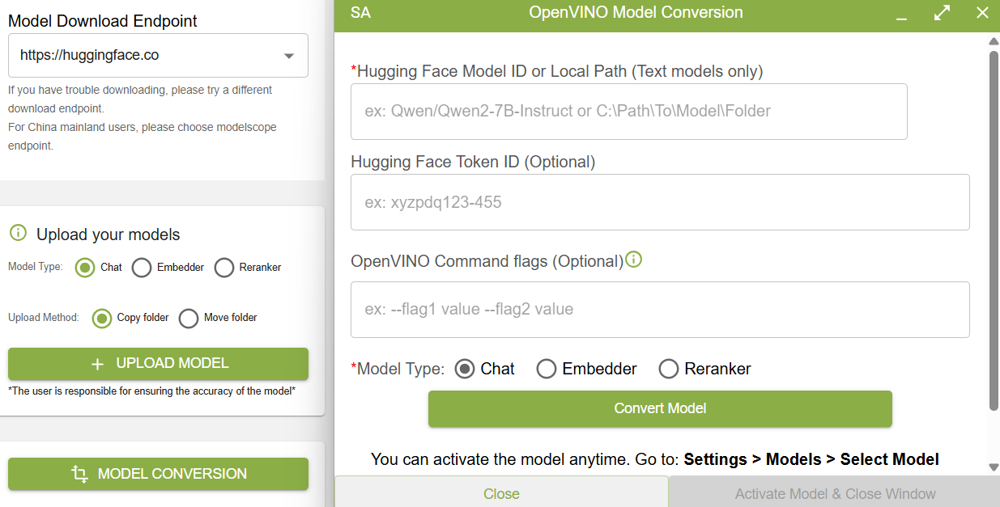

<h1 align="center">Intel® AI Assistant Builder (a.k.a. SuperBuilder)</h1>

<strong>Intel® AI Assistant Builder</strong>—also known as <strong>SuperBuilder</strong>—is Intel’s Gen-AI reference design platform that enables the rapid creation of custom AI assistants and agents tailored to specific industry needs and proprietary data.
These assistants streamline everyday tasks and deliver intelligent solutions by leveraging your internal knowledge bases—<strong>all while running entirely locally</strong> on Intel®-based AI PCs. Your data and workflows remain private and secure, powered by cutting-edge large language models (LLMs), customizable agentic workflows, and performance-optimized processing.

- [Why Choose Intel® AI Assistant Builder?](#why-choose-intel-ai-assistant-builder)
- [System Requirements](#system-requirements)
  - [Hardware Requirements](#hardware-requirements)
  - [Software Requirements](#software-requirements)
- [How to Get Started](#how-to-get-started)
- [Developer Resources](#developer-resources)
  - [User Interface Source Code](#user-interface-source-code)
  - [Code Examples and Tutorials](#code-examples-and-tutorials)
  - [API Documentation](#api-documentation)
- [LLM Models and Recommendations](#llm-models-and-recommendations)
- [Platform Capabilities](#platform-capabilities)
- [Coming Soon](#coming-soon)
- [Help and Troubleshooting](#help-and-troubleshooting)
- [What's New](#whats-new)
  - [Latest Release (Version 2.0.0)](#latest-release-version-200)
  - [Earlier Versions](#earlier-versions)
- [Get Support](#get-support)

 

## Why Choose Intel® AI Assistant Builder?
- **Simple & Accelerated Development**: Jumpstart your AI assistant with a rich set of prebuilt **APIs**, reusable **templates**, and a user-friendly tooling environment designed for fast prototyping and deployment.
- **Flexible & Modular Architecture**: Use our turnkey front-end reference design for immediate rollout or integrate only the backend components you need to build a fully customized experience.
- **Secure & Local Execution**: Keep your proprietary data and IP safe with AI that runs directly on-device—no cloud required.
- **Customizable for Any Industry**: Tailor assistants to meet the demands of your specific domain, whether in healthcare, finance, manufacturing, or beyond.
- **Scalable & Portable**: Package and deploy across a wide range of devices and use cases with ease.

 

With Intel® AI Assistant Builder, you can empower your teams and customers with intelligent, adaptable, and secure AI solutions—delivered simply and on your terms.

 

## System Requirements

The download, installation, and initial setup of the application require an internet connection. Once the initial setup is complete, no connection is needed unless you choose to change the model used by the assistant, in which case additional file downloads may be required.

### Hardware Requirements
  | **Component** | **Minimum Requirements**                                     | **Recommended Requirements**                |
  |---------------|--------------------------------------------------------------|---------------------------------------------|
  | Processor     | Intel® Core™ Ultra processor Series 1 (Meteor Lake)          | Intel® Core™ Ultra 200V series (Lunar Lake) |
  | Memory (RAM)  | 16GB                                                         | 32GB                                        |
  | Storage       | 4GB for AI Assistant with 1 LLM                              | 12GB for AI Assistant with 3 LLMs           |
  | Graphics      | Integrated Intel® Graphics                                   | Integrated Intel® Arc™ Graphics             |
  | Network       | Broadband connection for LLMs and other components’ download |                                             |
> [!NOTE]
>  * Intel® AI Assistant Builder has been validated on a limited set of Intel AIPC: MTL, LNL, and ARL systems.
> * Minimum Intel Graphics driver version is **30.0.100.9955** and minimum NPU driver version is **32.0.100.4239**. 

### Software Requirements
  Intel® AI Assistant Builder has been validated for use on **Microsoft Windows 11 version 23H2 or newer**. During the installation process, Intel® AI Assistant Builder application may download and install required components.

> [!TIP]
> To update your Intel® GPU and NPU drivers, please visit [Intel®: Download Drivers & Software](https://www.intel.com/content/www/us/en/download-center/home.html).

## How to Get Started
> [!WARNING]
> Currently, Intel® AI Assistant Builder supports **one Assistant installation at a time**. Please uninstall the existing Assistant before installing a different one.
- ### Download and Install the Software
1. Visit [https://aibuilder.intel.com](https://aibuilder.intel.com/)
2. Click on one of the available AI Assistants to start the download. For general use, we recommend the “Sales Assistant”. The assistant’s capability (and appearance) can be customized after installation.
3. Locate and open the downloaded installer. The wizard will guide you through the required steps to successfully complete the installation.

- ### Start Using Your AI Assistant
Please refer to the [user guide](https://aibuilder.intel.com/Intel%20AI%20Assistant%20Builder%20User%20Guide.pdf) for detailed instructions. See the "Getting Started" section to learn basic usage and the "Special Query Types" section to learn about special workflows.

 

## Developer Resources

### User Interface Source Code
The `src` folder contains our open-source UI components that power the SuperBuilder application interface. 

To get started with the UI source code, refer to the [UI development guide](src/superbuilderclient/README.md) for setup instructions and development guidelines.

### Code Examples and Tutorials
  This folder contains a sample application created using the SuperBuilder API service. We included sample projects built from `dotnet`, `Python` and `Go`. 

  [Sample Code](example/README.md)

### API Documentation
  Find the API documentation in the following links:

  [API Documentation - v2.0.0](https://intel.github.io/intel-ai-assistant-builder/v2.0.0)

  [API Documentation - v1.2.0](https://intel.github.io/intel-ai-assistant-builder/v1.2.0)

 

## LLM Models and Recommendations

Intel® AI Assistant Builder supports most LLM models enabled by <strong>Intel® OpenVINO Model Server</strong>. Model recommendations are made based on the assistant type and system hardware, using the performance and accuracy data collected inside our lab.
 

As of version `v2.0.0`, the following models are available for selection:

- **Chat Models**
  - Qwen3-8B-int4-ov
  - Qwen2.5-7B-Instruct-int4-ov
  - Phi-4-mini-instruct-int4-ov
  - DeepSeek-R1-Distill-Qwen-7B-int4-ov
  - zephyr-7b-beta-int4-ov
  - BioMistral-7B-SLERP-int4

- **Vision Models**
  - Phi-3.5-vision-instruct-int4-ov

  
- **RAG Models**
  - bge-base-en-v1.5-int8-ov
  - bge-reranker-base-int8-ov

- **NPU Models**
  - Phi3.5-mini-instruct-int4-cw-op-npu

You may also **upload your own model** or **convert models from Hugging Face directly** using the provided "Model Upload" or "Model Conversion" capabilities. Please consult the [user guide](https://aibuilder.intel.com/Intel%20AI%20Assistant%20Builder%20User%20Guide.pdf) for full details on these features.

 

 

## Platform Capabilities 
 * **Local LLM and RAG chat**: Build a local knowledge base from your documentation (multiple file formats supported).
 * **Configurable Parameters**: Tune LLM and RAG models, ingestion, retrieval, reranking, and application operations.
 * **Special Query Functions**: Specialized workflows for specific tasks:
   - **Super Agent (MCP)**: Route queries through MCP services with unlimited capability
   - **Analyze Tables**: Process tabular data files
   - **Summarize**: Generate file summaries with follow-up Q&A
   - **Query Image**: Extract text, generate captions, and vision tasks (requires vision model)
   - **Evaluate Resumes**: Score resumes against job descriptions
   - **Score Documents**: Rate documents against custom criteria
 * **Agentic Workflow Examples**: "Super Agent (MCP)" and "Resume Match" demonstrate real-world capability extensions.
 * **Model Management**: Switch, upload, or convert models for latest optimizations.
 * **UI Customization**: Customize interface appearance via Settings.
 * **Profile Management**: Import/export configurations for backup and sharing.
 * **Localization**: Simplified and Traditional Chinese support.
 * **Admin Mode**: Toggle between full admin access and simplified user interface.
 * **API Services**: Access all features through SuperBuilder APIs.
   
 

## :bulb: **Coming Soon** :sparkles:
* **E2E Enterprise Solution**: Connect your Intel AIPC to edge/server clusters for comprehensive enterprise integration.
* **SST and TTS multimodality Features**: Advanced speech synthesis and text-to-speech functionalities for enhanced user interaction and communication.

 

## Help and Troubleshooting
For comprehensive troubleshooting guidance, installation tips, and a complete list of known issues, please refer to the **"Troubleshooting and Known Issues"** section in the [user guide](https://aibuilder.intel.com/Intel%20AI%20Assistant%20Builder%20User%20Guide.pdf).

 

## What's New
### Latest Release (Version 2.0.0)
- Introducing MCP Support
We’ve added Model Control Protocol (MCP) support, enabling seamless import/export of MCP servers and agents, improved error handling, and enhanced UI/UX for managing workflows. This lays the foundation for more flexible agent-based orchestration and integration with external systems.

- Introducing New OVMS Backend
A new OpenVINO Model Server (OVMS) backend has been integrated into the system. This provides better scalability, cache handling for NPU/GPU models, and improved process management. It ensures more efficient model loading and execution, especially for large-scale workloads.

- Introducing Support for New Models
This release expands compatibility with Qwen3 (now the recommended model), and new NPU model configurations. These additions broaden the model ecosystem and improve flexibility for different use cases.

- New Workflows UI
A Custom Workflows UI has been introduced, providing users with more intuitive control over query flows, agent behaviors, and task automation. Enhancements include reusable components, better active file management, clickable references, and clear visual cues to differentiate current vs. recommended models. The MW and Backend APIs have been updated to improve clarity and simplify integrations.

- Improved Summarization & OOM Handling
Summarization has been significantly upgraded to include more context with multi-level and direct keyword-focused modes.
Overflow token and stop-chat handling fixes have been added to address out-of-memory (OOM) errors.

- Bug Fixes
This release addresses a wide range of issues, including CSV encoding errors, security vulnerabilities and regressions caused by dependency upgrades. These fixes collectively improve reliability and user experience across the platform.

### Earlier Versions

##### Version 1.2.2
- Enhanced Hardware Verification: We've refined our hardware check feature to ensure compatibility avoiding issues with the latest CPU models.

##### Version 1.2.1
- Service Only Installer
This installer will only install AI Assistant Builder service and backend. 

- Bug fix for Arrow Lake System
Fix installation issues with some Arrow Lake Systems. 

##### Version 1.2.0

- New Models Support
Intel(R) AI Assistant Builder now officially supports Qwen2.5-7B, Phi4-mini, and Deepseek-R1-Distilled-Qwen-7B.

- ModelScope Download Endpoint Support 
Intel(R) AI Assistant Builder now supports direct model downloads from ModelScope.cn, improving accessibility and convenience.

- Localization Support
Partial localization is available for Simplified Chinese (zh-Hans) and Traditional Chinese (zh-Hant). Language settings are automatically adjusted based on your Windows system language, but you may manually select the preferred language under *Settings > Appearance > Language*

- Admin Mode
Switch between a simple chatbot interface for "standard" users and an "Admin" interface with comprehensive configuration options. This enables administrators to configure, preview, and evaluate the end-user experience.

##### Version 1.1

- HF-Mirror for Users in PRC
The HF-Mirror provides users in the People's Republic of China with faster, more reliable access to models.

- Model Conversion to OpenVINO Format
The model conversion utility enables the conversion of most 'Text Generation' models to the OpenVINO format for immediate use in the assistant or wherever you plan to use a given model. You can convert models directly from Hugging Face or from a local folder. Optimized performance, compatibility, and efficiency of model execution are just a few benefits of this new utility. Please note that the model conversion utility does not work with all models, and it is important to verify the accuracy of any converted model.

- Import and Export Assistant
The new "Import and Export Assistant" feature simplifies the process of transferring data and configurations between computers and when conducting upgrades or re-installations. The option to export a "Built" assistant and allow another user to import it facilitates collaboration and sharing.

- New HR Special Query called Resume Match
The new HR assistant feature allows unlimited resume uploads in one session, intelligently scores resumes against job descriptions, extracts key details from top candidates using RAG, and facilitates continuous conversational analysis of documents.

- Update to Query Tabular Data
The Query Tabular Data feature now shows the SQL query used to generate the response, allowing users to verify, correct if necessary, and rerun the adjusted query.

- New Collect Metrics Parameter
The new Collect Metrics parameter, when enabled by the user, gathers performance metrics related to file ingestion and response generation, providing valuable insights.

##### Version 1.0

- User Interface
  - UX customization: Users can upload their own logo and customize additional app colors.
  - Users can upload their own LLM or RAG models. Instructions are provided to convert models to a compatible format. Intel does not guarantee that all models will work.

- AI Features
  - Query Summary: Users can attach up to three files (PDF, DOCX, TXT) and generate a summary of each file, allowing them to ask follow-up questions based on the summary.
  - Query Tabular Data: Users can attach one file (XLSX, CSV). The data must be in tabular format, with headers in the first row and data in subsequent rows. This feature generates a description of the tabular data in each worksheet.
  - Query Images: Users can attach up to three files (PNG, JPEG, JPG) and generate a description of each image. This requires a vision model such as Phi-3.5-vision-instruct-int4-ov.

- NPU Model
  - NPU model support for Phi3-4K now offers an improved token length of 2K.

- New Assistant
  - Added Finance Assistant.

## Get Support
For technical questions and feature requests, please use GitHub [Issues](https://github.com/intel/intel-ai-assistant-builder/issues).

We would love to hear about your experience. Please contact us at [&#115;&#117;&#112;&#112;&#111;&#114;&#116;&#046;&#097;&#105;&#098;&#117;&#105;&#108;&#100;&#101;&#114;&#064;&#105;&#110;&#116;&#101;&#108;&#046;&#099;&#111;&#109;](mailto:support.aibuilder@intel.com).

[Back to Top](#toc)